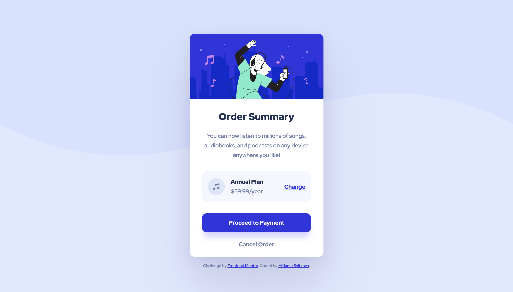

# Frontend Mentor - Order summary card solution

This is a solution to the [Order summary card challenge on Frontend Mentor](https://www.frontendmentor.io/challenges/order-summary-component-QlPmajDUj). Frontend Mentor challenges help you improve your coding skills by building realistic projects.

## Table of contents

- [Overview](#overview)
  - [The challenge](#the-challenge)
  - [Screenshot](#screenshot)
  - [Links](#links)
- [My process](#my-process)
  - [Built with](#built-with)
  - [Useful resources](#useful-resources)
  - [What I learnt thanks to feedback](#what-i-learnt-thanks-to-feedback)
- [Author](#author)

## Overview

### The challenge

Users should be able to:

- See hover states for interactive elements

### Screenshot

### Links

- [Solution URL](https://www.frontendmentor.io/solutions/card-component-using-css-variables-and-flexbox-pYG56bvAy)
- [Live Site URL](https://miri52.github.io/order-summary-component/)

## My process

### Built with

- CSS custom properties (variables)
- Flexbox
- Mobile-first workflow
- Media queries

### Useful resources

- [Box shadows](https://www.joshwcomeau.com/css/designing-shadows/) - A great article about creating more realistic shadows.
- [The Responsive Web Design Bootcamp](https://scrimba.com/learn/responsive) - An amazing course with the CSS Evangelist Kevin Powell. Media queries, flexbox, grid, and much more.

### What I learnt thanks to feedback

- purely decorative icons should have aria-hidden: "true" to improve accessibility
- to remove the line underneath an img, use display: block

Thanks [kens_visuals](https://github.com/kens-visuals)

## Author

- Frontend Mentor - [miri52](https://www.frontendmentor.io/profile/miri52)
- LinkedIn - [Miriama Svítková](https://www.linkedin.com/in/miriama-svitkova)
